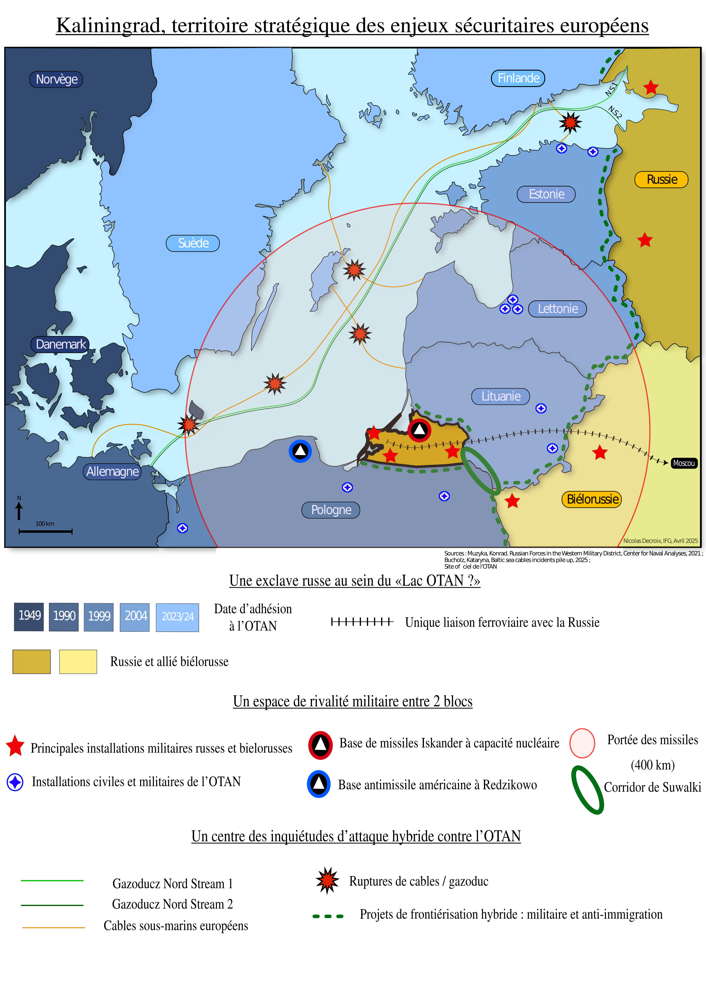
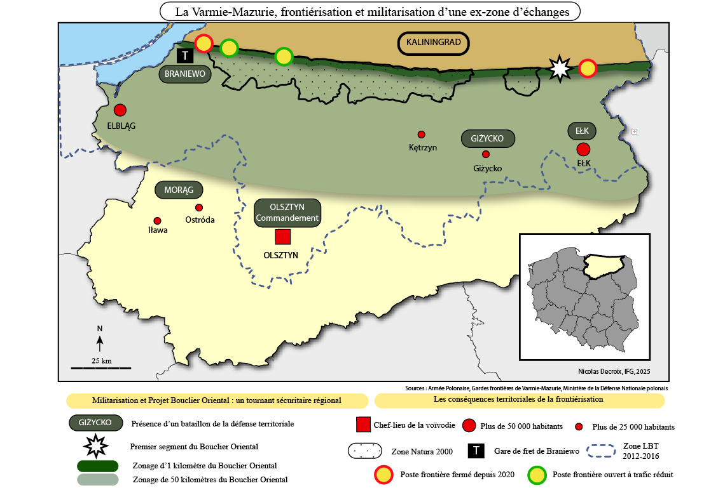

<!DOCTYPE html>
<html lang="en">
<head>
  <meta charset="UTF-8" />
  <meta name="viewport" content="width=device-width, initial-scale=1.0" />
  <title>Nicolas Decroix | Portfolio</title>
  
</head>

<body>
  

    <!-- HERO -->
    <header>
      <h1>Nicolas Decroix</h1>
      
Diplomé Master II Géopolitique | Spécialisé Défense/OTAN | Sécurité Flanc Est et Arctique

      

        I build fast, clean, and user-focused web applications.
      

      

        <a href="mailto:decroix.nicolasfrancois@gmail.com">Email</a>
        <a href="CV DECROIX Nicolas.pdf" target="_blank">CV</a>
      

    </header>

    <!-- PROJECTS -->
    

      <h2>Projects</h2>

  

  
Mémoire de Master 1

  
La Pologne et l'exclave de Kaliningrad : projet Bouclier Oriental et nouvelles réalités 
frontalières dans le contexte sécuritaire de la guerre en Ukraine.

  <ul>
    <li>Travail de recherche continu sur l'année de M1 combinant<strong> études théoriques, collecte d'informations en sources ouvertes et revues de presse</strong>.</li>
    <li><strong>Terrain de recherche d'un mois en Pologne</strong>, entre Varsovie, Olsztyn et la frontière russo-polonaise. Rencontres et interviews en <strong>anglais et polonais</strong> avec des représentants locaux (maires, administrateurs régionaux), universitaires et habitants de la zone.</li>
    <li>Création de <strong>représentations cartographiques originales</strong> afin d'illustrer mes recherches.</li>
    <li>Aboutissement de ce travail de recherche en un <strong>mémoire de 120 pages, obtenant la note de 17/20</strong></li>
  </ul>
  

     

    <iframe src="https://drive.google.com/file/d/1biwjkTJpX5jVcjh5E2IlDCJIIUYt-F4T/preview" width="50%" height="300px"></iframe>
       

    
    
    
  

     

    <a href="#">Live</a>
    <a href="#">Code</a>
  

      

        
Weather Dashboard

        
Real-time weather app using external API.

        <ul>
          <li>API integration with dynamic UI</li>
          <li>Responsive design</li>
          <li>Optimized loading performance</li>
        </ul>
        

          <a href="#">Live</a>
          <a href="#">Code</a>
        

      

    

    <!-- SKILLS -->
    

      <h2>Skills</h2>
      

        <strong>Languages:</strong> JavaScript, Python 
        <strong>Frontend:</strong> React, HTML, CSS 
        <strong>Tools:</strong> Git, Figma, VS Code
      

    

    <!-- ABOUT -->
    

      <h2>About</h2>
      

        Computer Science graduate focused on frontend development and UI design.
        I enjoy building practical tools and improving user experience.
        Currently looking for junior developer roles.
      

    

    <!-- CONTACT -->
    <footer>
      <h2>Contact</h2>
      
Email: you@email.com

      
GitHub: github.com/yourusername

    </footer>

  

</body>
</html>
<!--
git add .
git commit -m "Mise à jour du code"
git push origin main

- 🔭 I’m currently working on ...
- 🌱 I’m currently learning ...
- 👯 I’m looking to collaborate on ...
- 🤔 I’m looking for help with ...
- 💬 Ask me about ...
- 📫 How to reach me: ...
- 😄 Pronouns: ...
- ⚡ Fun fact: ...
-->
