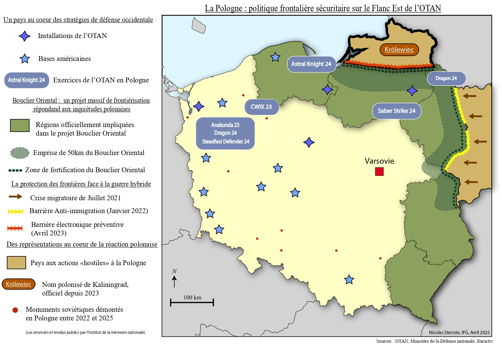

<!DOCTYPE html>
<html lang="fr">
<head>
  <meta charset="UTF-8" />
  <meta name="viewport" content="width=device-width, initial-scale=1.0" />
  <title>Nicolas Decroix | Portfolio Analyste</title>
  
</head>
<body>

  <aside class="sidebar">
    <h1>Nicolas Decroix</h1>
    
Analyste Géopolitique & Défense

    
    <nav>
      <button class="nav-btn active" onclick="showTab(event, 'exps')">💼 Parcours & Stages</button>
      <button class="nav-btn" onclick="showTab(event, 'recherche')">📚 Mémoire & Cartes</button>
      <button class="nav-btn" onclick="showTab(event, 'skills')">🛠 Compétences</button>
      <button class="nav-btn" onclick="showTab(event, 'formation')">🎓 Formation</button>
    </nav>

    

      📍 Paris, France 
      📞 +33 (0)7 69 28 30 80
    

  </aside>

  <main class="main-content">
    
    

      <h2>Parcours Professionnel & Stages</h2>
      
      

        

          Student Assistant to the Secretary General
          Nov. 2024 — Déc. 2025
        

        European Reform Universities Alliance (ERUA) - Paris-VIII
        <ul>
          <li>Rapports analytiques de documents européens sur l’éducation pour la secrétaire générale.</li>
          <li>Création de présentations et d’ateliers de comité de pilotage.</li>
          <li>Analyse d’assurance qualité et d’impact de l’alliance.</li>
          <li>Organisation et vérification de conformité sur les bases de données collaboratives.</li>
          <li>Réunions et productions réalisées intégralement en anglais pour les partenaires européens.</li>
          <li>Veille sur les évènements européens du secteur de l’éducation.</li>
        </ul>
      

      

        

          Stagiaire Recherche - Programme 13-Novembre
          Juillet — Août 2023
        

        CNRS - Equipex MATRICE
        <ul>
          <li>Transcription de témoignages de victimes des attentats de 2015 et de déportés français.</li>
          <li>Suivi rigoureux du vade-mecum de transcription.</li>
          <li>Respect strict des protocoles et de la clause de confidentialité.</li>
        </ul>
      

      

        

          Stagiaire au service Urbanisme
          Juillet — Août 2022
        

        Mairie de Caluire-et-Cuire
        <ul>
          <li>Travail de recherche pour l'implantation de mode de production d'énergie solaire sur la ville.</li>
          <li>Rédaction de notes et rapports à destination du maire.</li>
          <li>Utilisation intensive de SIG : ArcGIS, QGIS.</li>
        </ul>
      

    

    

      <h2>Mémoire : Kaliningrad & Frontière Russo-Polonaise</h2>
      

        
<strong>Sujet :</strong> La militarisation de la frontière et les nouvelles réalités géopolitiques de l'exclave. Travail récompensé par la note de <strong>17/20</strong>.

        
        

          

            <iframe src="https://drive.google.com/file/d/1biwjkTJpX5jVcjh5E2IlDCJIIUYt-F4T/preview" width="100%" height="100%" style="border:none;"></iframe>
          

          

            
            <img src="Carte-Rég
